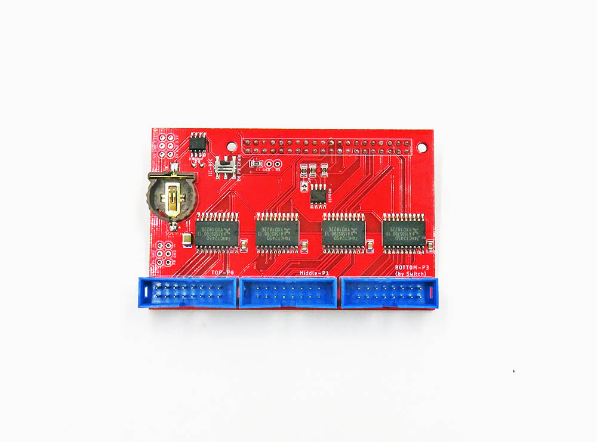

# Raspberry Pi LED Matrix Slot Machine
A Slot Machine running on a Raspberry Pi with an RGB LED Matrix Display

## Hardware

### [Electrodragon RGB LED Matrix Panel Drive Board For Raspberry Pi](https://www.electrodragon.com/product/rgb-matrix-panel-drive-board-raspberry-pi/)



## Set up the Pi

### OS

Use the [Raspberry Pi Imager](https://www.raspberrypi.com/software/) to create the OS image for your Pi.

This project has been developed on a Raspberry Pi 4 running *Bullseye - light* with SSH enabled and a public key installed. Installing the oublic key will make your life easier if you like to use the VSCode Remote SSH plugin to develop directly on the Pi.

### Tooling

#### Update the OS packages: 
```bash
sudo apt update
sudo apt full-upgrade
```

#### Install Tools and Dependencies 

Some packages may not be required but are specified in the [hzeller rpi-rgb-led-matrix library repo](https://github.com/hzeller/rpi-rgb-led-matrix) on which this project depends. 

<!-- TODO: verify the actual requirements of the LED Matrix Library, or maybe just poin to the requirements in the library's repo. -->

```bash
sudo apt install \
    git \
    python3 \
    python3-pip \
    pkg-config \
    graphicsmagick \
    libwebp \ 
    ffmpeg
```

### Turn off Pi Audio
There is a conflict between the LED matrix library and the audio hardware on the Pi.

Edit `/boot/config.txt` and set `dtparam=audio=off` then reboot the Pi.

### [VSCode](https://code.visualstudio.com/) Remote SSH (Optional - develop as you like)

Using the [VSCode Remote SSH](https://marketplace.visualstudio.com/items?itemName=ms-vscode-remote.remote-ssh) extension:
- Set up a remote host connection to the Pi
- Set up the [Python](https://marketplace.visualstudio.com/items?itemName=ms-python.python) extension to work in Python to facilitate working in VSCode directly on the Pi. 

### Install the RGB LED Matrix Library

1. Download or clone the [hzeller rpi-rgb-led-matrix](https://github.com/hzeller/rpi-rgb-led-matrix) library repo into your development directory on the Pi. We will use it to build and install the library on teh Pi but its location doesn't matter.
1. In the root of the repo, build the library and install the python bindings using the `install-python` Make target. Youn will need to be root to get the libs into the system python library directory:<br><br>
`sudo make install-python`

### Give it a spin!
At this point you can attach the Pi Hat to the Pi and the LED Matrix and try the  demo in this repo to make sure that things are working:<br><br> 

`sudo ./demo/blinkit.sh`

This should blink the LED Matrix in yellow with a 3 second cycle.

If all is well, have a look at the code for this project in the [app](./app) directory in this repo.

### Troubleshooting
1. This app was built against commit `a3eea997a9254b83ab2de97ae80d83588f696387` of the LED Matrix Library. Try checking out that commit in the library repo and building installing it:<br><br>
```bash
git checkout a3eea997a9254b83ab2de97ae80d83588f696387
sudo make clean
sudo make install-python
```


